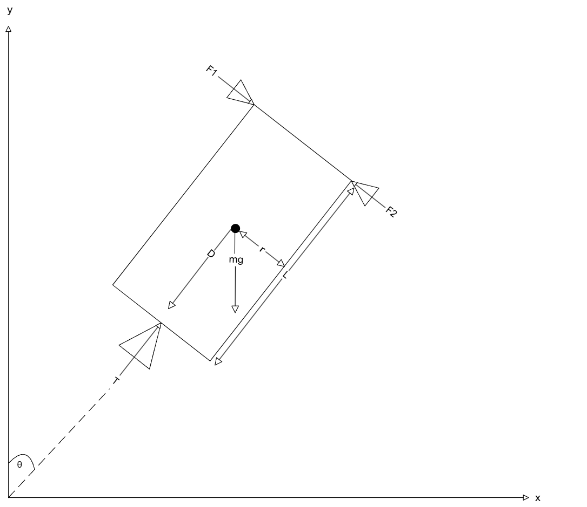
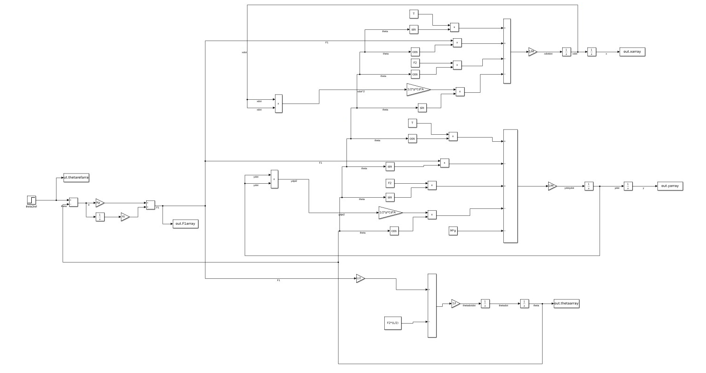
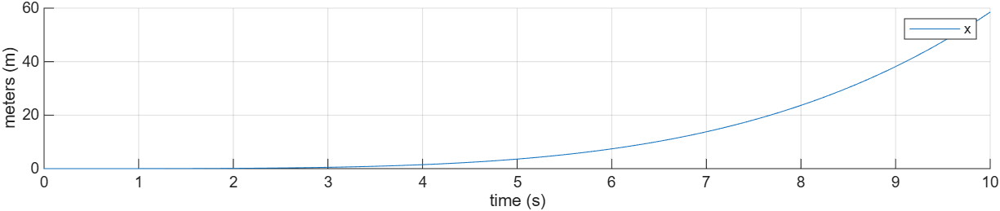
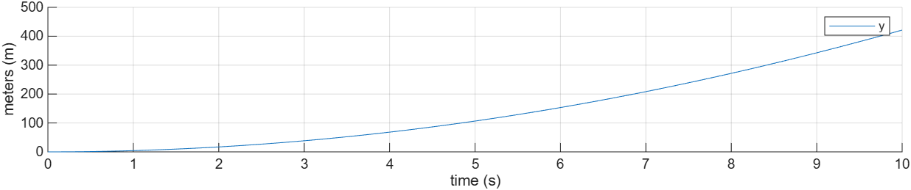
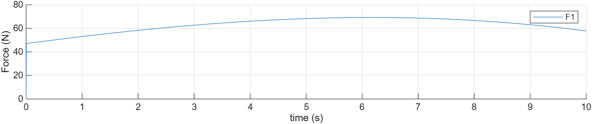
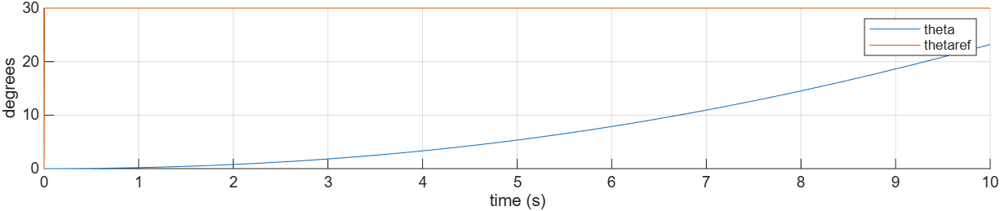

# Rocket Dynamics and PI Pitch Angle Control Simulation

A MATLAB and Simulink project focused on modeling and controlling a two-dimensional rocket using rigid-body dynamics, aerodynamic drag, and closed-loop PI control.


## Overview

This project explores the modeling, simulation, and control of a two-dimensional rocket using first-principles physics.

The simulation was developed in MATLAB and Simulink to investigate how thrust, gravity, aerodynamic drag, and rotational dynamics influence rocket flight behavior. A PI controller is used to command the rocket toward a desired pitch angle while simultaneously modeling the vehicle's translational and rotational motion.


## System Description

The rocket is modeled as a rigid body operating in two dimensions.

The simulation tracks:

- Horizontal position (x)
- Vertical position (y)
- pitch angle (θ)

The coordinate system is defined such that:

* Positive x points horizontally to the right
* Positive y points upward
* Gravity acts in the negative y direction
* θ = 0° corresponds to a vertically oriented rocket
* Positive θ is directed in the clockwise direction

## Assumptions

The following assumptions are used throughout the simulation:

* The rocket is modeled as a rigid body with a uniform mass distribution.
* Structural flexibility and bending effects are neglected.
* Aerodynamic lift forces are neglected.
* Fuel consumption is not modeled; the rocket mass remains constant.
* The main thrust is assumed to be constant.
* The mass moment of inertia is approximated using a slender-bodied rod model.

For the simulated maneuver, the following conditions are assumed for $t > 0$:

* $x > 0$, $\dot{x} > 0$
* $y > 0$, $\dot{y} > 0$
* $\theta > 0$, $\dot{\theta} > 0$


## Physical Parameters

| Parameter | Description | Value |
|-----------|-------------|-------|
| $m$ | Rocket Mass | 3000 kg |
| $L$ | Rocket Length | 15 m |
| $r$ | Rocket Radius | 0.25 m |
| $T$ | Main Thrust | 55,000 N |
| $g$ | Gravity | $9.8\ \text{m/s}^2$ |
| $C_d$ | Drag Coefficient | 0.25 |
| $\rho$ | Air Density | $1.225\ \text{kg/m}^3$ |

The rocket mass moment of inertia is approximated as:

$$
I = \frac{m(3r^2 + L^2)}{12}
$$

## Free Body Diagram

The force configuration used in the simulation is shown below.




## Governing Equations

The rocket dynamics are derived using Newton's Second Law and rigid-body rotational dynamics.

### Horizontal Dynamics
$$
\sum F_x = m \alpha_x
$$
$$
m \ddot{x} = T \sin{\theta} + F_1 \cos{ \theta} - F_2 \cos{ \theta} - D \cos{ \theta}
$$

### Vertical Dynamics

$$
\sum F_y = m \alpha_y
$$
$$
m \ddot{y} = T \cos{\theta} - F_1 \sin{ \theta} + F_2 \sin{ \theta} - D \cos{ \theta} - mg
$$

### Rotational Dynamics

$$
I \ddot{ \theta} = F_1 \frac{L}{2} - F_2  \frac{L}{2}
$$

where aerodynamic drag is modeled separately and applied opposite the vehicle velocity.


## Aerodynamic Drag Model

Aerodynamic drag is modeled as:

$$
D = \frac{1}{2} \rho C_d A v^2
$$

where:

* ρ = air density
* C_d = drag coefficient
* A = cross-sectional area
* v = vehicle velocity

And the cross-sectional area is approximated by:

$$
A = \pi r^2
$$


## PI Controller Design

A proportional-integral (PI) controller is used to regulate the rocket pitch angle.

The controller law is:

$$
u(t) = K_p e(t) + K_i \int_0^t e(\tau)\,d\tau
$$

where the pitch angle error is defined as:

$$ 
e(t) = \theta_{ref} - \theta(t)
$$

and:

- $u(t)$ is the controller output
- $K_p$ is the proportional gain
- $K_i$ is the integral gain
- $\theta_{ref}$ is the desired pitch angle
- $\theta(t)$ is the current pitch angle


The controller continuously adjusts the thrust command to drive the rocket toward the desired angle reference.

### Controller Parameters

| Parameter | Value |
|-----------|-------|
| $\theta_{ref}$ | 30° |
| $K_p$ | 90 |
| $K_i$ | 12 |

The controller continuously adjusts the thrust response within the simulation to drive the vehicle toward the desired pitch angle.

## Simulation Parameters

### Initial Conditions

| Variable | Value |
|----------|-------|
| $x_0$ | 0 m |
| $y_0$ | 0 m |
| $\theta_0$ | 0 rad |
| $\dot{x}_0$ | 0 m/s |
| $\dot{y}_0$ | 0 m/s |
| $\dot{\theta}_0$ | 0 rad/s |

### Simulation Settings

| Parameter  | Value   |
| ---------- | ------- |
| Final Time | 10 s    |
| Time Step  | 0.005 s |

## Simulink Implementation

The Simulink model numerically integrates the rocket equations of motion and implements the PI control loop used for pitch angle regulation.

The mathematical model was implemented in Simulink using:

* Integrator blocks
* Gain blocks
* Summation blocks
* Trigonometric functions
* Feedback control loops

The model computes:

* Position
* Velocity
* Acceleration
* Ptich angle
* Angular velocity
* Controller output

through numerical integration of the governing equations.




## Simulation Results

### Horizontal Position Response



### Vertical Position Response



### Controller Response



### Pitch Angle Tracking Response



### Observations

The rocket successfully increases the pitch angle while tracking the commanded angle reference, and the PI controller produces a stable response and gradually rotates the vehicle toward the desired 30° target pitch angle. 


## Repository Structure

```text
RocketSimulation/
│   README.md
│   
├───docs
│       Project_Report.pdf
│       RocketSimulation_SimulinkModel.png
│       
├───results
│       RocketSimulation_F1_response.png
│       RocketSimulation_theta_response.png
│       RocketSimulation_x_position.png
│       RocketSimulation_y_position.png
│       
├───simulink
│       RocketSimulation_sim.slx
│       
└───src
        RocketSimulation.m
```

### Potential Future Enhancements

- **Full PID Control Implementation**
  - Add derivative control to improve controller response and reduce overshoot.

- **Fuel Consumption and Mass Depletion**
  - Model decreasing vehicle mass during flight to better represent real rocket behavior.

- **Real-Time Telemetry Dashboard**
  - Stream simulation data to a live dashboard for visualization and analysis.

- **Three-Dimensional Rocket Dynamics**
  - Extend the simulation to incorporate z-plane.

## Tools and Methods

* MATLAB
* Simulink
* PI Control
* Numerical Simulation
* Dynamic System Modeling

## Author

**Gabriel Sahlin**

Bachelor of Science in Applied Mathematics and Computer Science with interests in modeling and simulation, aerospace systems, control theory, embedded systems, and software engineering.
